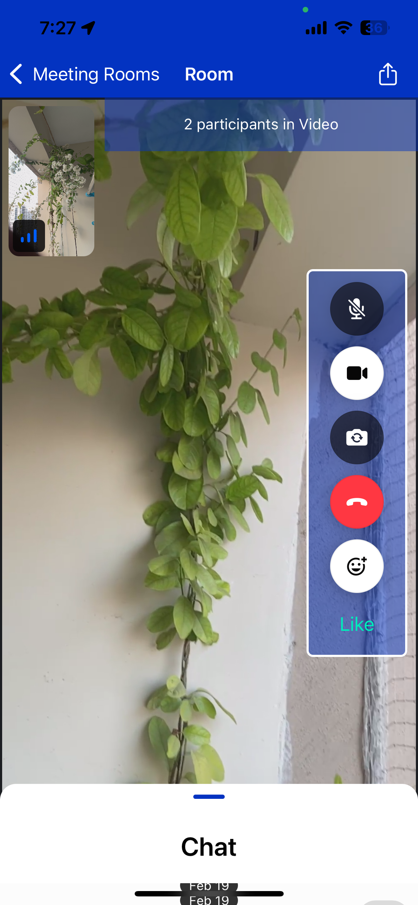
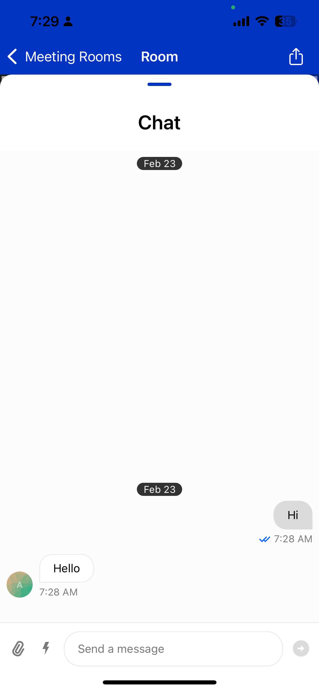
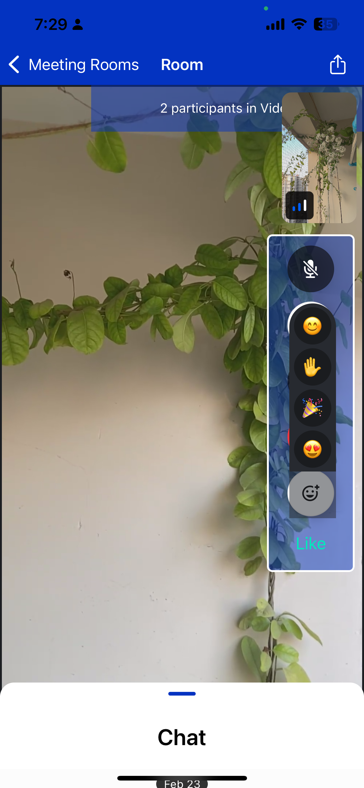

# Mobile Video Chat App

Meeting app is a mobile app for video calling and live group in video meeting.

## Features

- Login and register
- Create Video chat room
- Join Video chat by id
- Join existing rooms
- Deeplink to join call on click on link

## Tech

- [expo (React Native)] - Mobile (Android and iOS) application
- [expo-router] - File based navigation in react native
- [Express JS] - Backend api for Login, register and get stream api key
- [railway.app] - Host backend api.
- [getstream Video] - Get Stream Video chat library
- [getstream Chat] - Get Stream Live chat library

## Screenshots

[//]: # "These are reference links used in the body of this note and get stripped out when the markdown processor does its job. There is no need to format nicely because it shouldn't be seen. Thanks SO - http://stackoverflow.com/questions/4823468/store-comments-in-markdown-syntax"
[expo (React Native)]: https://expo.dev/
[Express JS]: https://expressjs.com/
[getstream Video]: https://getstream.io/video/
[getstream Chat]: https://getstream.io/chat/
[expo-router]: https://docs.expo.dev/router/introduction/
[railway.app]: https://railway.app/
